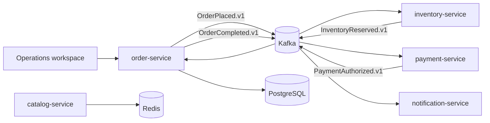

# CommerceFlow Architecture

CommerceFlow is a **safe, synthetic e-commerce workflow laboratory**. It demonstrates a saga-shaped order lifecycle without accepting customer identities, payment-card details, or production traffic. The operational boundary begins at the order command and ends with a notification event; the system never calls a payment processor or message-delivery provider.

## Execution Modes

| Mode | Intended use | Dependencies | Evidence generated |
|---|---|---|---|
| `deterministic-local` | Portfolio review and unit tests | Java order service only | A reproducible five-event saga in memory |
| `kafka` | Full observability and integration lab | Kafka, PostgreSQL, Redis, all service containers | Versioned topic events and independently deployable consumer boundaries |

The shared `CommerceEvent` contract carries an event identifier, aggregate order identifier, event type, producer identity, schema version, timestamp, and metadata. Every consumer must treat the event identity as an idempotency key when connected to a real broker. This keeps retries from becoming duplicate business actions and is aligned with the at-least-once delivery model common to event brokers.[1]

> The platform deliberately uses a **synthetic authorization** step. It exists to demonstrate choreography and workflow observability, not payments handling.

## Service Responsibilities

| Service | Responsibility | State boundary | External-facing effect |
|---|---|---|---|
| `order-service` | Accept order command, emit lifecycle events, expose operations API | Service-owned order repository | None |
| `catalog-service` | Serve fixed synthetic product records | Redis-backed read cache in full lab | None |
| `inventory-service` | Consume order creation and publish reservation outcome | Reservation boundary | None |
| `payment-service` | Consume reservation and publish a synthetic authorization result | Authorization boundary | None |
| `notification-service` | Consume completion event | Notification event boundary | None |

## References

[1] [Apache Kafka Documentation — Message Delivery Semantics](https://kafka.apache.org/documentation/#semantics)
